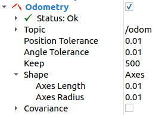

.. _navigation2-with-master-controller:

Navigating with Master Controller
**************************************

- `Overview`_
- `Requirements`_
- `Tutorial Steps`_
- `Comparison`_

Overview
========

This tutorial shows how to utilize :ref:`Master Controller <configuring_master_controller>` with :ref:`DWB <configuring_dwb_controller>` controller as default plugin.
Completing :ref:`getting_started` is highly recommended especially if you are new to ROS and Nav2.

Requirements
============

It is assumed that ROS 2, Gazebo and TurtleBot3 packages are installed or built locally. Please make sure that the Nav2 project is also built locally as it was mentioned in :ref:`build-instructions`.

Tutorial Steps
==============

0. Setup Environment Variables
----------------------------------

Run the following commands when you open a new terminal to follow this tutorial.

.. code-block:: bash

  source /opt/ros/<ros2-distro>/setup.bash
  export TURTLEBOT3_MODEL=waffle
  export GAZEBO_MODEL_PATH=$GAZEBO_MODEL_PATH:/opt/ros/<ros2-distro>/share/turtlebot3_gazebo/models

1. Launch simulation with parameters configured in advance
----------------------------------------------------------

You will need to launch TurtleBot3 simulation with the set parameters i.e. Master Controller + DWB local planner

.. code-block:: bash

  ros2 launch nav2_bringup tb3_simulation_launch.py params_file:=$(ros2 pkg prefix --share nav2_bringup)/params/nav2_mc_params.yaml

2. Initialize the Robot Location
--------------------------------

Follow the same process as in the section **Navigating** :ref:`getting_started` to initialize robot position

3. Add the odometry topic in **RViz** to see the followed trajectory
--------------------------------------------------------------------
In **RViz** Click on **Add** button in the section **Displays**, then choose **/odom** topic in the tab **By topic**
Configure the odometry accordingly the screenshot.

4. See trajectory of DWB + Master Controller
--------------------------------------------

To watch the result of the work of the master controller, you need to send the robot to the point that is located behind.
The master controller will restore the robot's path. Then the default plugin (DWB in our case) might follow this path.

Comparison
==========

As we see in **figure 2** movement's trajectory is rounded at the beginning of the path.
Such a trajectory is caused by the fact that the linear velocity is not zero until the robot will be on the path.
The Master Controller blocks DWB until the robot will return on the path.

    Trajectory with Master Controller:

    Trajectory without Master Controller:
